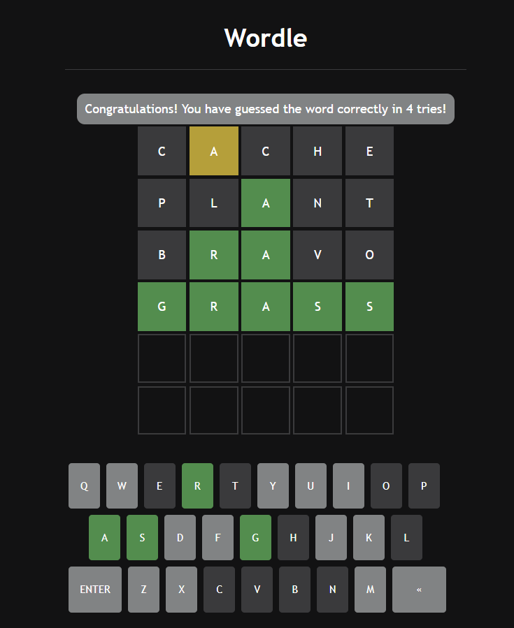

# Wordle Clone

This is a clone of the popular word guessing game called Wordle. It is made using Express, React and Node.js.

## How to Run

Clone the repository and navigate to the following link to obtain an API key:

https://rapidapi.com/sheharyar566/api/random-words5

Open the `index.js` file and replace `{API_KEY}` with your key.

Run the following commands in your terminal to install he dependencies and start the server:

```
$> npm install
$> npm start
```

Open http://localhost:8000 in your browser.


